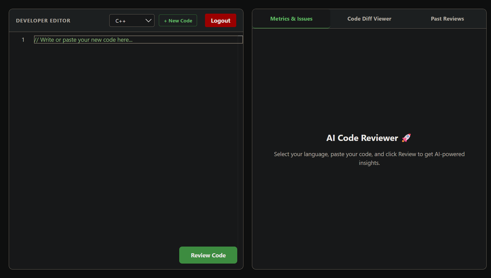
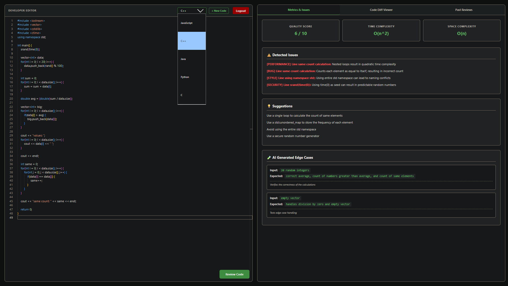
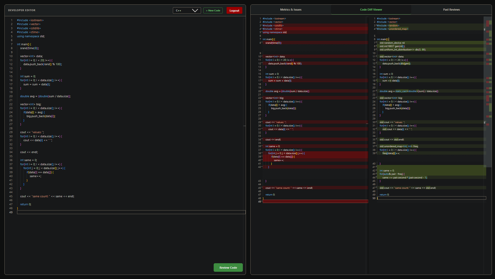
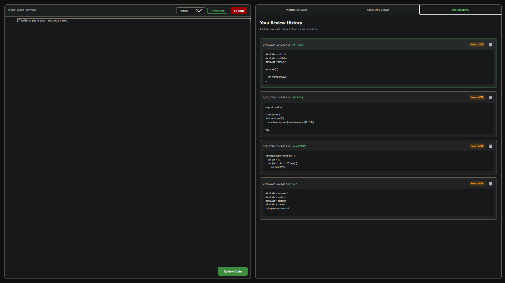
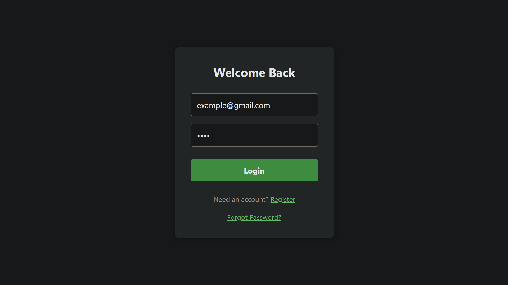
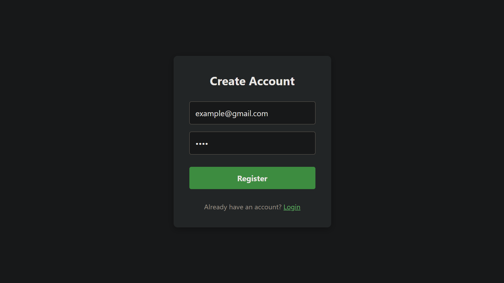
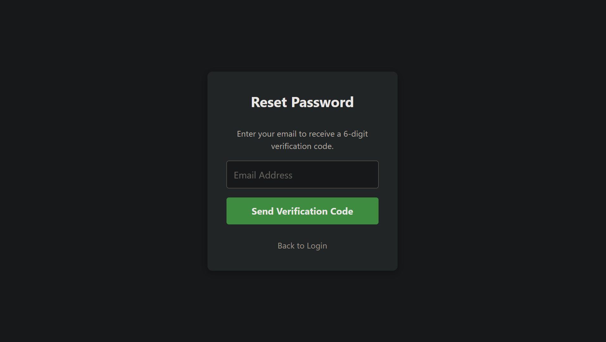

# 🤖 AI Code Reviewer & Debugging Assistant

<p align="center">
  
  
  
  
  
  
  
</p>

<p align="center">
  <em>🚀 An enterprise-grade AI developer tool that instantly reviews code, detects bugs, suggests optimizations, and analyzes algorithmic complexity.</em>
</p>

---

## 🌐 Live Demo
🔗 **[Experience the Live Application Here](https://ai-code-reviewer-frontend-two.vercel.app/)**

---

## 📸 Application Preview

### 🖥 Main Code Editor
The primary workspace where developers paste code, select their language, and request AI analysis.
<p align="center"></p>

### 📊 AI Analysis Results
The engine returns detailed bug reports, performance suggestions, and best-practice recommendations.
<p align="center"></p>

### 🔍 Code Difference Viewer (AI Refactor Comparison)
A professional side-by-side diff editor highlighting exact line changes for AI refactoring.
<p align="center"></p>

### 📜 Persistent Review History
All previous code reviews are stored securely so users can track improvements and revisit past analysis.
<p align="center"></p>

---

## 🔐 Secure Authentication Architecture

This project implements a complete, stateless authentication flow designed for modern SaaS applications.

<p align="center">
  
  
  
</p>

### 🔄 Enterprise Password Reset Flow (Redis + Nodemailer)
1. User requests a password reset.
2. A cryptographic 6-digit OTP is generated and emailed.
3. The OTP is cached in **Redis** with a strict 15-minute Time-To-Live (TTL) expiration.
4. User inputs the OTP; backend verifies against the Redis cache.
5. Password is securely updated and re-hashed.

---

## ✨ Core Features

* **🤖 AI-Powered Code Analysis:** Leverages LLMs to provide deep insights, bug detection, and code improvements.
* **📊 Algorithmic Complexity Detection:** Automatically calculates Time (Big-O) and Space complexity.
* **🔍 Interactive Code Diff Viewer:** Side-by-side visual comparison between your original code and the AI's optimized refactor.
* **📜 Code Review History:** Safely stores all past reviews in the database.
* **🔐 Secure Authentication:** JWT-based secure login, protected routes, and bcrypt password hashing.
* **🔄 Advanced Password Recovery:** Highly secure NodeMailer + Redis architecture utilizing expiring OTPs.

---

## 🏗 System Architecture

```text
[ Frontend (React + Vite) ] 
       │
       ▼ (REST API / JWT Auth)
[ Backend (Node.js + Express) ] ──▶ [ Redis Cache ] (OTP & Session TTL)
       │
       ├─▶ [ MongoDB ] (User Data & Review History)
       │
       ▼ 
[ LLM AI Service ] (Code Parsing & Analysis)

```

---

## 🛠 Tech Stack

* **Frontend:** React, JavaScript, CSS, Monaco Editor
* **Backend:** Node.js, Express.js
* **Database:** MongoDB, Mongoose
* **Caching & Security:** Redis, JWT, Bcrypt.js, Nodemailer
* **Deployment:** Vercel

---

## 📂 Project Structure

```text
CODE-REVIEWER/
├── BackEnd/
│   ├── config/
│   ├── controllers/
│   ├── models/
│   ├── routes/
│   └── services/
├── Frontend/
│   ├── src/
│   │   ├── components/
│   │   ├── pages/
│   │   └── styles/
├── screenshots.png/
└── README.md

```

---

## ⚙️ Local Installation & Setup

**1. Clone the repository**

```bash
git clone [https://github.com/Aakarsh2007/AI-Code-Reviewer.git](https://github.com/Aakarsh2007/AI-Code-Reviewer.git)

```

**2. Backend Setup**

```bash
cd BackEnd
npm install

```

Create a `.env` file in the `BackEnd` directory:

```env
PORT=5000
MONGO_URI=your_mongodb_connection_string
JWT_SECRET=your_super_secret_jwt_key
REDIS_URL=your_redis_cloud_url
EMAIL_USER=your_gmail_address
EMAIL_PASS=your_16_char_google_app_password
AI_API_KEY=your_ai_model_key
FRONTEND_URL=http://localhost:5173

```

Start the backend server:

```bash
npm start

```

**3. Frontend Setup**

```bash
cd ../Frontend
npm install
npm run dev

```

---

## 🔄 Example Workflow

1️⃣ User registers or logs in.

2️⃣ User pastes code into the editor.

3️⃣ User clicks **Review Code**.

4️⃣ AI analyzes the code logic.

5️⃣ AI returns bugs, improvements, and complexity analysis.

---

## 🔒 Security Features

* **JWT Authentication**
* **Secure Password Hashing (Bcrypt)**
* **OTP Expiration via Redis (15m TTL)**
* **Protected API Routes**
* **Strict Input Validation**

---

## 📈 Real World Applications

This system is engineered for:

* Automated code review tools
* AI-powered developer assistants
* Coding education & mentorship platforms
* Developer productivity pipelines

---

## 👨‍💻 Author

**Aakarsh Saxena** *Aspiring AI Engineer & Full Stack Developer* *B.Tech in Information Technology | IIIT Lucknow*

---

## ⭐ Support

If you found this project helpful or interesting, please consider leaving a ⭐ on the repository!

